# Latent Circuit Inference for a Dynamic Routing Task

Training a recurrent neural network (RNN) to perform a context-dependent dynamic routing task — where the rewarded stimulus switches across blocks and the network must **infer context purely from reward feedback** — as the first phase of replicating the latent circuit inference framework from [Langdon & Engel (2025, *Nature Neuroscience*)](https://github.com/engellab/latentcircuit).

This project was developed iteratively using ASTA plugin (https://asta.allen.ai) on Claude Code. ASTA launched experiments, diagnosed failures, and iterated on architecture and training strategies autonomously, maintaining a version-controlled `research_state.md` across ~15 experimental iterations.

## The Task

A mouse-inspired go/no-go paradigm with block-switching:

- **4 stimuli** (vis1, vis2, aud1, aud2) + catch trials
- **6 blocks per session** (~90 trials each); the rewarded target alternates between vis1 and aud1 each block
- **No explicit context cue** — the network must infer which target is rewarded from the conjunction of its own lick responses and reward delivery
- 5 instruction trials (free reward) at each block start bootstrap the context switch

The core challenge: maintaining a stable context belief across ~90 trials using only sparse, self-generated reward signals, then rapidly updating that belief at block transitions.

<p align="center">
  
</p>

## Architecture

**IntegratorRNNCoarse** — a continuous-time RNN (Euler-discretized, ReLU, N=100 units) with two key modifications that emerged from iterative failure analysis:

1. **Coarse temporal discretization** (dt=100ms instead of 20ms) — reduces the number of recurrent steps per trial from 125 to 25, improving signal retention from ~0.8%/trial to ~60%/trial
2. **Leaky reward integrator** (channel 7) — a dedicated scalar that accumulates reward history via `c = tanh(γ·c + (1-γ)·δ)`, providing a persistent context signal that the recurrent dynamics alone could not maintain

<p align="center">
  
</p>

## Training Curriculum

A 5-stage curriculum mirroring the actual mouse training protocol:

| Stage | Task | Advancement criterion |
|-------|------|-----------------------|
| 0 | Auto-rewards (bias shaping) | Fixed steps |
| 1 | Visual discrimination (vis1 vs vis2) | d' > 1.5 × 2 evals |
| 2 | Auditory discrimination (aud1 vs aud2) | d' > 1.5 × 2 evals |
| 3 | Block switching with timeout | d'\_intra > 1.5 AND d'\_inter > 1.5 in ≥4/6 blocks |
| 4 | Final task (no timeout, reduced LR) | Stable across 5 evals |

<p align="center">
  
</p>

## ASTA-Driven Iteration History

The agent was given three input documents and iterated autonomously:

| Input document | Purpose |
|----------------|---------|
| `mission.md` | High-level goals and constraints |
| `experiment_task_details/EXPERIMENT.md` | Experimental protocol details |
| `latent_circuit_dynamic_routing_spec.md` | Full architecture and training spec |

### Key iterations and findings

Stages 0–2 trained easily. Stage 3 (block switching) was the bottleneck — the network needed to learn context inference from reward feedback. ASTA identified **four root causes** of failure through systematic ablation:

| Root cause | Fix | Experiment |
|------------|-----|------------|
| Signal decay over trials | Leaky reward integrator | `checkpoints_integrator/` |
| Gradient blindness at block boundaries | 2-block BPTT (180 trials) | `checkpoints_coarse_2block/` |
| Attractor bootstrap deadlock | Context teacher forcing | `checkpoints_ctx_teacher/` |
| Gradient variance (batch=1) | batch=4 | `checkpoints_integrator_coarse_v2/` |

The **explicit context ablation** (injecting ground-truth ±1.0 as channel 7) proved the architecture is correct — it solved Stage 3→4 in ~1000 steps with d'\_inter=2.74. The remaining challenge is bridging from explicit context to learned context inference via teacher forcing with `eval_alpha=0`.

See `research_state.md` for the full experimental log and `insights.md` for a detailed failure analysis.

## Project Structure

```
├── mission.md                              # Goals and constraints
├── research_state.md                       # Living experiment log (version-controlled)
├── insights.md                             # Systematic failure analysis
├── latent_circuit_dynamic_routing_spec.md  # Full 3-phase project spec
├── background_knowledge.md                 # Environment and setup notes
│
├── models/
│   ├── rnn.py                    # Base RNN (dt=20ms)
│   ├── rnn_coarse.py             # Coarse-dt RNN (dt=100ms)
│   ├── rnn_gru.py                # GRU variant (failed — bootstrap deadlock)
│   ├── rnn_integrator.py         # RNN + reward integrator
│   └── rnn_integrator_coarse.py  # IntegratorRNNCoarse (current best)
│
├── tasks/
│   ├── dynamic_routing.py        # Trial generation and stimulus sampling
│   ├── dynamic_routing_coarse.py # Coarse-dt trial generation
│   ├── session.py                # Session/block sequence generation
│   ├── session_coarse.py         # Coarse-dt sessions
│   └── curriculum.py             # Stage advancement logic, d' computation
│
├── training/
│   ├── train_rnn.py              # Original training script (dt=20ms)
│   ├── train_coarse.py           # Coarse-dt training
│   ├── train_coarse_2block.py    # 2-block BPTT training
│   ├── train_gru_teacher.py      # GRU with teacher forcing
│   ├── train_integrator.py       # Integrator-only training
│   ├── train_integrator_coarse.py        # Integrator + coarse
│   ├── train_integrator_coarse_2block.py # + 2-block BPTT
│   ├── train_integrator_coarse_ctx.py    # + context loss (v1)
│   ├── train_integrator_coarse_v2.py     # + batch=4, γ curriculum (v2)
│   ├── train_explicit_ctx.py     # Ceiling ablation (explicit ±1.0 context)
│   └── train_ctx_teacher.py      # Context teacher forcing (current)
│
├── utils/
│   ├── metrics.py                # d', hit/FA rates
│   └── plotting.py               # Training curves, behavioral plots
│
├── analysis/
│   └── check_licks.py            # Lick behavior diagnostics
│
├── design/                       # Architecture and curriculum diagrams (SVG)
├── history/                      # Versioned backups of research_state.md
└── .asta/                        # ASTA experiment artifacts
    ├── checkpoints_*/            # Training checkpoints per approach
    └── experiment/               # Dated experiment bundles with logs and reports
```

## Setup

```bash
# Create the conda environment
conda env create -f environment.yml

# Activate it
conda activate latent_circuit

# Run training (example: context teacher forcing v2)
python training/train_ctx_teacher.py

# Checkpoints are saved to .asta/checkpoints_ctx_teacher/
```

**Key dependencies:** PyTorch 2.10 (CPU), NumPy, SciPy, matplotlib, pandas, tensorboard. See `environment.yml` for the full list.

## Current Status

- **Stages 0–2:** Solved (seed 42, `checkpoints_v24/`)
- **Stage 3 ceiling:** Proven solvable with explicit context (d'\_inter = 2.74)
- **Stage 3 learned:** In progress — context teacher forcing v2 with `eval_alpha=0`
- **Stage 4 / Phase 2–3:** Not yet started

## References

- Langdon, C. & Engel, T.A. (2025). Latent circuit inference from heterogeneous neural responses during cognitive tasks. *Nature Neuroscience*. [GitHub](https://github.com/engellab/latentcircuit)
